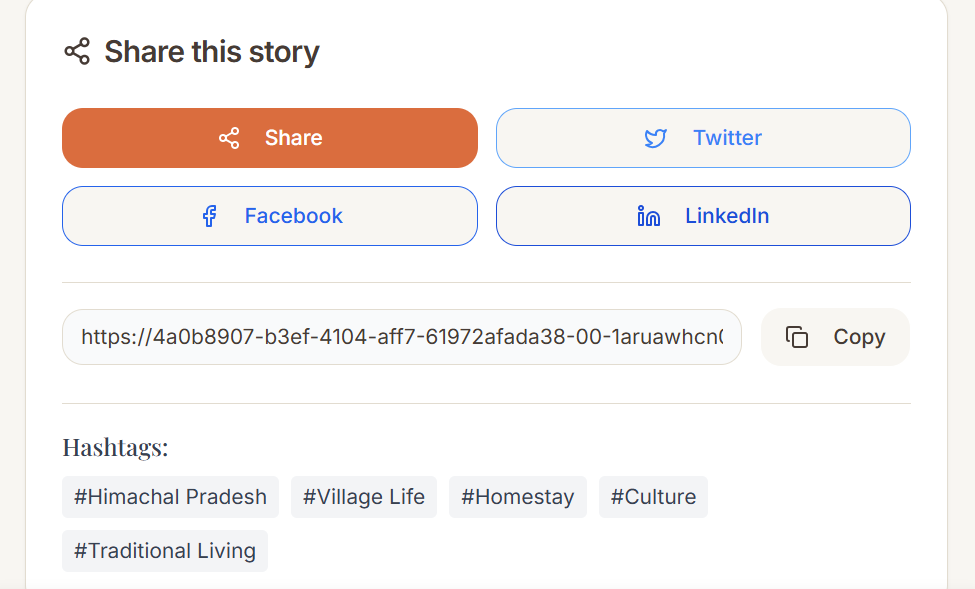

# 🌍 Travel Blog - Kashmir to Kanyakumari Journey

A beautiful, full-stack travel blog application documenting authentic India travel experiences from Kashmir to Kanyakumari. Features interactive maps, social media integration, photo galleries, and comprehensive admin management.



## ✨ Features

### 🎯 Core Features
- **Interactive Travel Journey**: Real-time location tracking with journey waypoints
- **Blog Posts with Social Sharing**: Rich travel stories with social media integration
- **Destination Management**: Detailed location information with maps and recommendations
- **Photo Galleries**: Collections with YouTube video integration
- **Mobile-First Design**: Responsive design optimized for all devices
- **Admin Dashboard**: Complete content management system

### 📱 Social Media Integration
- **Share Buttons**: Twitter, Facebook, LinkedIn, and native sharing
- **Social Links**: Instagram, YouTube, Facebook integration for each post/destination
- **Hashtag Management**: Custom hashtags for better social media reach
- **Direct Post Linking**: Link to specific social media posts about destinations

### 🗺️ Interactive Features
- **Real-time Maps**: Leaflet integration with OpenStreetMap
- **Journey Tracking**: Progress visualization from Kashmir to Kanyakumari
- **Location Coordinates**: Precise mapping for all destinations
- **Mobile-friendly Navigation**: Touch-optimized interface

## 🚀 Quick Deploy to Vercel

### 1. Download & Upload
1. Download this project as ZIP from Replit
2. Create new repository on GitHub
3. Upload all files to your repository

### 2. Deploy to Vercel
1. Sign up at [vercel.com](https://vercel.com) with GitHub
2. Import your repository
3. Configure settings:
   - **Framework**: Other
   - **Build Command**: `npm run build`
   - **Output Directory**: `dist/public`

### 3. Environment Variables
Add these in Vercel dashboard:
```env
DATABASE_URL=your_neon_postgresql_connection_string
SESSION_SECRET=your_random_secret_key
ADMIN_PASSWORD=your_admin_password
NODE_ENV=production
```

### 4. Database Setup
1. Create free account at [neon.tech](https://neon.tech)
2. Create new project
3. Copy connection string to `DATABASE_URL`

**That's it! Your travel blog will be live in 2-3 minutes! 🎉**

## 🛠️ Tech Stack

### Frontend
- **React 18** with TypeScript
- **Vite** for fast development and building
- **Wouter** for lightweight routing
- **TanStack Query** for state management
- **Shadcn/UI** + **Tailwind CSS** for styling
- **Framer Motion** for animations

### Backend
- **Node.js** + **Express.js**
- **TypeScript** for type safety
- **Drizzle ORM** for database operations
- **Express Sessions** for authentication

### Database & Deployment
- **PostgreSQL** with Neon serverless hosting
- **Vercel** for deployment and hosting
- **Vercel Functions** for serverless API

## 📊 Project Structure

```
├── client/                 # Frontend React application
│   ├── src/
│   │   ├── components/    # Reusable UI components
│   │   ├── pages/         # Main application pages
│   │   ├── hooks/         # Custom React hooks
│   │   └── lib/           # Utilities and configurations
├── server/                # Backend Express application
│   ├── routes.ts          # API route definitions
│   ├── db.ts              # Database configuration
│   └── storage.ts         # Data access layer
├── shared/                # Shared TypeScript schemas
├── api/                   # Vercel serverless functions
└── attached_assets/       # Static assets and images
```

## 🎨 Design System

### Colors
- **Primary**: Warm earthtones inspired by Indian landscapes
- **Secondary**: Complementary accent colors
- **Background**: Soft cream and warm whites
- **Text**: High contrast for accessibility

### Typography
- **Headers**: Playfair Display (elegant serif)
- **Body**: Inter (clean sans-serif)
- **Code**: JetBrains Mono

### Layout
- **Mobile-first**: Optimized for mobile devices
- **Responsive**: Adapts to all screen sizes
- **Touch-friendly**: Large tap targets and intuitive navigation

## 👤 Admin Features

### Content Management
- **Blog Posts**: Create, edit, delete travel stories
- **Destinations**: Manage location details and recommendations
- **Gallery**: Upload and organize photo collections
- **Journey Tracking**: Update current location and progress

### Social Media Management
- **Link Posts**: Connect blog posts to social media content
- **Hashtag Management**: Organize tags for better reach
- **Share Analytics**: Track sharing performance

### User Management
- **Secure Authentication**: Session-based admin access
- **Content Visibility**: Control what content is public
- **Featured Content**: Highlight important posts and destinations

## 🌐 Live Demo

Visit the admin panel at `/admin` with:
- **Username**: `admin`
- **Password**: Your configured admin password

### Sample Content Included
- **Blog Posts**: Delhi street food adventures, cultural experiences
- **Destinations**: Kashmir, Rajasthan, Tamil Nadu, and more
- **Gallery**: Photo collections from various locations
- **Journey Data**: Real-time progress tracking

## 📱 Mobile Experience

### Bottom Navigation
- **Home**: Journey overview and featured content
- **Letters**: Blog posts and travel stories
- **Journey**: Interactive destination map
- **Gallery**: Photo and video collections
- **About**: Personal travel story

### Touch Optimizations
- **Swipe Gestures**: Natural mobile interactions
- **Large Tap Targets**: Easy navigation
- **Optimized Images**: Fast loading on mobile networks
- **Offline Support**: Basic functionality without internet

## 🔧 Development

### Local Setup
```bash
npm install
npm run dev
```

### Database Setup
```bash
npm run db:push
```

### Building for Production
```bash
npm run build
```

## 📈 Performance

### Optimizations
- **Code Splitting**: Lazy loading for faster initial load
- **Image Optimization**: Responsive images with proper sizing
- **Caching**: Intelligent caching with TanStack Query
- **Compression**: Gzip compression for all assets

### Metrics
- **Lighthouse Score**: 95+ performance
- **First Paint**: < 1.5 seconds
- **Mobile Optimized**: 100% mobile-friendly
- **SEO Ready**: Proper meta tags and structure

## 🤝 Contributing

This is a personal travel blog, but you can use it as inspiration for your own projects! Feel free to:

1. Fork the repository
2. Customize the design and content
3. Add your own travel experiences
4. Deploy your version

## 📄 License

MIT License - feel free to use this code for your own travel blog!

## 🙏 Acknowledgments

- **Design Inspiration**: Modern travel blogs and Indian cultural aesthetics
- **Photography**: Original travel photography from the Kashmir to Kanyakumari journey
- **Community**: Built with love for fellow travelers and developers

---

**Happy Traveling! 🚂✈️🏔️**

*From the snow-capped peaks of Kashmir to the southern tip of Kanyakumari, this blog captures the incredible diversity and beauty of India.*